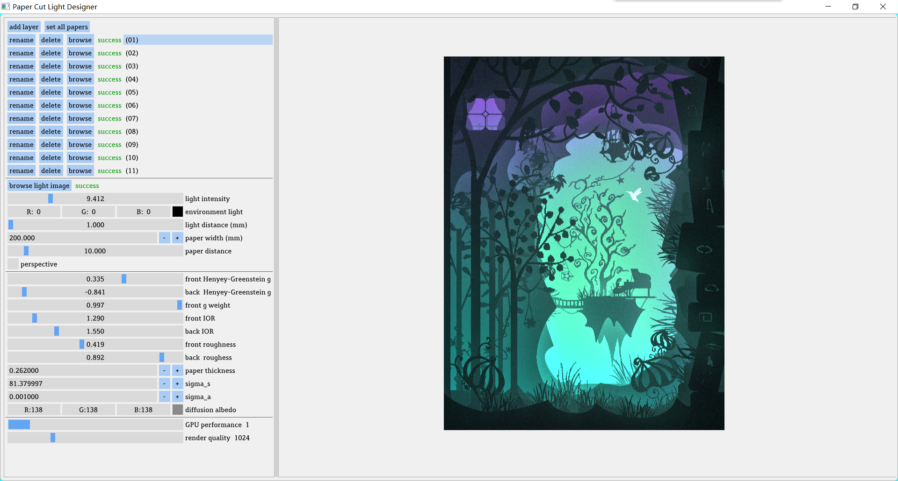

# Paper Cut Light Previewer (PCLP)

[Paper cut light box](https://www.google.com/search?q=paper+cut+light+box&tbm=isch) is a light box which consists of layered paper cuts. AIK, it's hard to design how it looks like before we actually make it and put LED lights behind the layers. So I write this previewer to compute the appearance of light boxes.

PCLP is written with C++ and DirectX 11, so it only runs on Windows.

## Screenshot



## Usage

### Build From Source

```powershell
git clone --recursive https://github.com/AirGuanZ/PaperCutLight.git
cd PaperCutLight
mkdir build
cd build
cmake .. -DPCL_CN=OFF
```

* use `PCL_CN=ON/OFF` to select chinese/english version.

### Download Prebuilt Binaries

[Win10-64bit](https://github.com/AirGuanZ/PaperCutLight/releases)

### User Manual

[English Version](https://github.com/AirGuanZ/PaperCutLight/tree/master/doc/manual-en/manual.md)

[简体中文](https://github.com/AirGuanZ/PaperCutLight/tree/master/doc/manual-cn/manual-cn.md)

## Reference

Papas, M., de Mesa, K. and Jensen, H.W. (2014), A Physically‐Based BSDF for Modeling the Appearance of Paper. Computer Graphics Forum, 33: 133-142.

