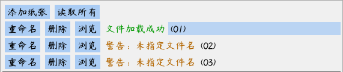

# PCL使用指南

可以在[此处](https://github.com/AirGuanZ/PaperCutLight/releases)下载到PCL的64位Win10版本。启动PCL后，会看到如下用户界面：

其中左半部分是设置纸张、光源等信息的面板，右半部分则是预览的效果。上图中，由于没有设置纸张和光源，预览部分呈现为黑色。

左边的面板被黑色分割线划分为上下两部分，上边用于设置纸张的雕刻数据，可以容纳任意多层纸张，初始时仅包含一层；下边用于设置背灯、环境光、纸张间距、纸张材质参数等数据。

## 导入背光

PCL用二维点阵图像来表示纸雕灯背面光源的颜色信息，支持bmp/jpg/png三种图像格式。图像上的颜色表示了背光对应位置处的颜色。点击左边面板分割线下方的“浏览光源文件”按钮，软件会弹出一个文件选择器，如下图所示：

在文件选择器中，双击以进入文件夹，双击上方“..”以回到上一级，单击以选择图像文件。在选择好了光源文件后，“浏览光源文件”按钮右方会显示“文件加载成功”，并且预览面板会展示光源颜色，如下图所示：

## 导入纸张

在刚启动时，PCL默认只有一层纸张，可以点击左上角的“添加纸张”来增加新的纸张。比如，连续添加两层之后，界面如下图所示：

PCL以二维图像表示纸张的雕刻信息，图像上纯黑色的区域为镂空的区域，其他区域则是被纸张占据的区域。点击“浏览”来选择一幅图像，选择后如下图所示：

纸张列表中上方的层位于纸雕灯靠前的位置，下方的层位于靠背面的位置。用左键拖拽纸张右侧的“(01)”，“(02)“等名字，可以调整各层间的顺序。

PCL要求背光图像的分辨率以及所有纸张图像的分辨率完全相同。在正确设置了光源和纸张后，预览面板就可以显示出结果了：

也可以点击左上角的“读取所有”，在弹出的文件选择界面中按住左Ctrl键选择多个图像文件。PCL会按文件名将它们排好序，导入为多层纸张。

## 自动刷新

在导入了纸张和光源文件后，PCL会自动检测这些文件的改动情况。一旦它们有所变化，PCL就会自动更新之前读取的数据。因此，可以在保持PCL运行的情况下用图像编辑软件修改文件，PCL会在保存文件后自动重新加载图像数据。

## 其他选项

**光源亮度**. 调整背光的亮度，初始值为1。若觉得光源过暗，可以适当提高。

**环境光**. 点击颜色小方块以调整纸雕灯周围环境的亮度，初始值为黑色，即四周一片黑暗。

**光源间距**. 调整背光板与最后一层纸张之间的距离。

**纸张水平尺寸**. 调整纸张在现实中的宽度，这会影响光照效果。

**纸张间距**. 调整纸张之间的间隔距离。

**使用透视摄像机**. 模拟真实世界中“近大远小”的视觉效果。

**曝光度**. 摄像机曝光参数。

**纸张材质**. 关于纸张光学性质的高级参数，请参照论文《A Physically‐Based BSDF for Modeling the Appearance of Paper》以获知其详细含义。

**采样设置**. 关于光线传输模拟的高级参数。

