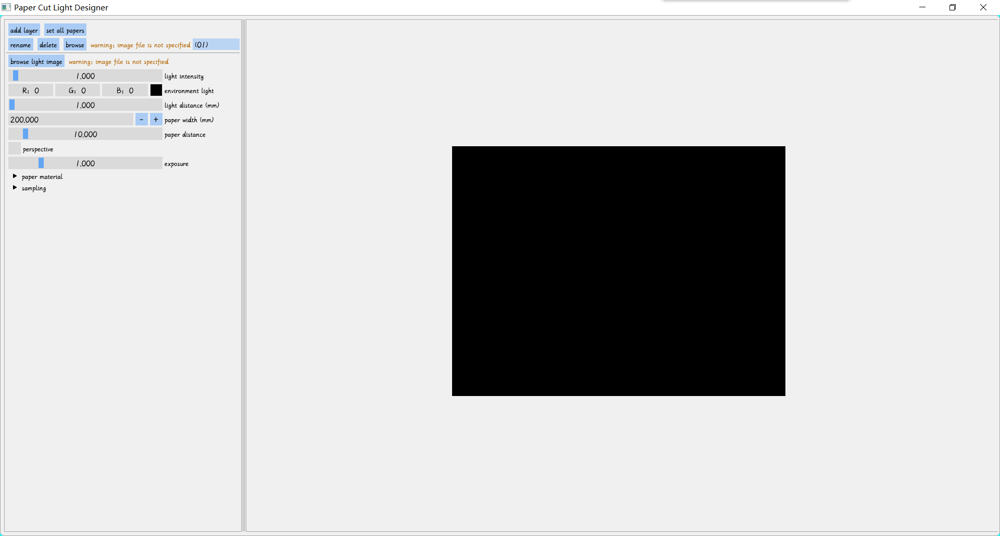
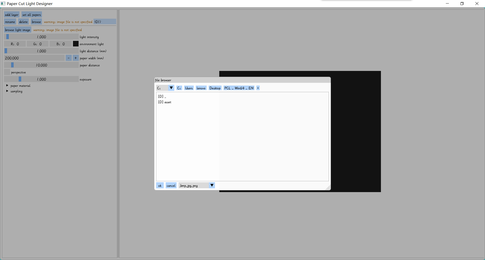
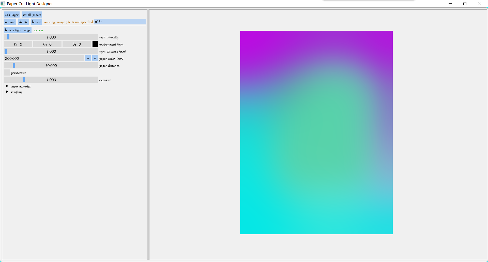
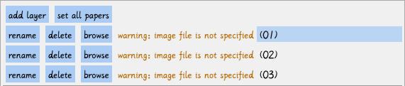
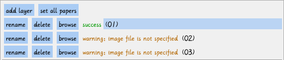
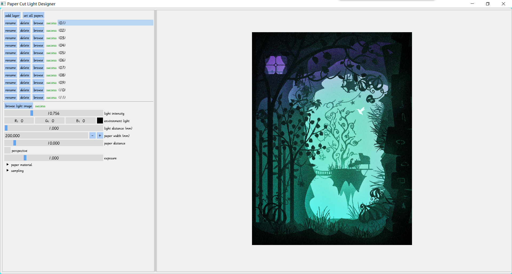

# PCL User Manual

[Download PCL for 64-bit Win10](https://github.com/AirGuanZ/PaperCutLight/releases)

After launching PCL, you will see the following user interface:

The left is a panel for setting information such as paper, light source, etc. The right is the preview panel. In the above picture, the preview panel is black because no paper and light source are specified.

The left panel is divided into upper and lower parts by a black dividing line. The upper part is used to set the 'cut' data of the papers, and initially contains only one layer; the lower part is used to set the backlight, ambient light, paper spacing, and material parameters.

## Import Backlight Data

PCL uses an image to represent the color information of the light source on the back of the light box. Three image formats are supported: bmp, jpg and png. The color on the image represents the color at the corresponding position of the backlight. Click the "browse light image" button below the dividing line on the left panel, the software will pop up a file dialog, as shown below:

In the file dialog, double-click to enter a folder, double-click the upper ".." to return to the previous folder, and single-click to select an image file. After selecting the light source image, the preview panel will display the light source color, as shown below:

## Import Paper Data

PCL only contains one layer of paper after launching. You can click "add layer" in the upper left corner to add a new layer. For example, after adding two layers, PCL looks like:

PCL uses two-dimensional images to represent the cut information of the papers. The pure black area on the image is the hollowed out area, and the others are the occupied areas. Click "browse" to select an image, as shown in the figure below after selection:

The upper layer in the layer list is at the front of the light box, and the lower layer is at the back. You can drag the "(01)", "(02)" and other names on the right side of the layers to adjust their orders.

PCL requires the resolution of the backlight image and the resolution of all paper images to be exactly the same. After setting the light source and papers correctly, the preview panel will display the result:

You can also click "set all papers" in the upper left corner, and hold the `left Ctrl`  to select multiple image files. PCL will sort them by name and import them as multiple layers.

## Auto Refreshing

After importing the papers and light source, PCL will automatically detect the changes in these image files. Once changed, PCL will update the previously read data. Therefore, you can use any image editing tool to modify the images while the PCL is running, and PCL will automatically reload the image data after saving.

## Misc

**Paper Material Model**. Papas, M., de Mesa, K. and Jensen, H.W. (2014), A Physically‐Based BSDF for Modeling the Appearance of Paper. Computer Graphics Forum, 33: 133-142.

